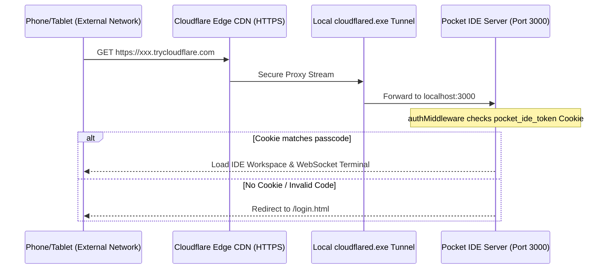

# Pocket IDE 📱

[](https://opensource.org/licenses/MIT)
[](https://nodejs.org/)
[](https://www.cloudflare.com/products/tunnel/)
[](#multi-provider-ai-coding-agent)

A self-hosted, premium, mobile-responsive cloud development platform and AI agent playground. Pocket IDE lets you write, test, run, and sync code directly from your smartphone, tablet, or any web browser worldwide.

---

## 🌟 Core Features

### 🤖 Multi-Provider AI Coding Agent
Pocket IDE is built with a unified multi-agent loop (`agent.js`) supporting:
*   **Google Gemini**: Powering swift operations via the native `@google/generative-ai` SDK.
*   **OpenAI (GPT-4o / GPT-4o-mini)**: Integrated natively over Node `fetch` with full tool-calling support.
*   **Anthropic Claude (Claude 3.5 Sonnet / Haiku)**: Integrated natively over Node `fetch` utilizing Claude tool-use blocks.
*   **Autonomous Capabilities**: The agent operates recursively with full system permissions to:
    *   List files recursively (`list_files`).
    *   Read files (`read_file`).
    *   Write or edit code (`write_file`).
    *   Execute shell commands (`run_command`) to run server scripts, install dependencies, or execute builds.

### 🌐 Secure Global Access (One-Click Cloudflare Tunnel)
Work from anywhere without port-forwarding or local Wi-Fi limitations:
*   **Native cloudflared Integration**: Starts a secure, public tunnel URL (`https://*.trycloudflare.com`) on demand using the official `cloudflared` executable.
*   **Strict Security Middleware**: If an access passcode is configured:
    *   Unauthenticated browser requests are redirected to a glassmorphic `/login.html` portal.
    *   API routes and WebSocket terminal upgrades are blocked with `401 Unauthorized` headers until authenticated.
    *   Secured via cookie tokens (`pocket_ide_token`) valid for 7 days.
*   **Instant Mobile Sync**: Generates a copyable link and a dynamic QR code for quick smartphone scanning.

### 📦 Integrated Git & GitHub Control Center
Manage repositories directly from the sidebar (desktop) or bottom tab (mobile):
*   **Clone Repositories**: Wipe local workspace and clone public or private repos (with Personal Access Tokens).
*   **File Status Tracking**: Displays current branch name and color-coded change badges (Modified `M`, Added/Untracked `??`, Deleted `D`).
*   **Pull, Commit & Push**: Sync with remote repositories in one click using simple commit text fields.
*   **Tracking Disconnect**: Instantly disconnect Git tracking (`.git` deletion) in one click to work locally or swap repos.

### 🎨 Sleek Minimalist Workspace
*   **Bottom Navigation Bar**: Pinned at the bottom of mobile viewports for native app-like tab swapping.
*   **Custom Drag Resizers**: Replaced bulky default scrollbar grips with elegant, custom divider bars:
    *   A vertical resizer bar with a hover-amplified pill handle controls the sidebar width.
    *   A horizontal resizer bar controls the editor height.
*   **Custom Themes (HSL Driven)**: Swap visual themes on the fly in Settings:
    *   `Midnight Blue`: Polished dark slate layout.
    *   `Cyberpunk`: Electric violet, neon pink, and gold.
    *   `Light Mode`: Clean, bright white & light blue.
*   **Editor Customizations**: Live-updated font resizing slider (`10px`–`24px`).
*   **Image Viewer**: Clicking an image opens it in a split side-viewer panel rather than standard code lines.

---

## 📐 Architecture & Security flow



---

## 🛠 Prerequisites

*   [Node.js](https://nodejs.org/) (v18.0.0 or higher)
*   Git command-line client installed and added to your system PATH.
*   An API Key from your chosen AI provider (obtainable from Google AI Studio, OpenAI Developer Console, or Anthropic Console).

---

## 🚀 Quick Start

### 1. Installation
Clone the repository locally and install dependencies:
```bash
git clone https://github.com/Harsha-Sidd/Pocket-IDE.git
cd Pocket-IDE
npm install
```

### 2. Run the Server
Start the development server:
```bash
npm start
```
The console will output:
`Pocket IDE is running on http://localhost:3000`

### 3. Accessing the IDE
*   **Locally**: Open your browser to `http://localhost:3000`.
*   **On the Same Wi-Fi**: Scan the QR code in Settings or go to `http://<your-local-ip>:3000`.
*   **Globally**: 
    1. Click the Gear icon in the top header.
    2. Toggle **Enable Public Tunnel URL**.
    3. Enter a **Workspace Access Password**.
    4. Click **Save Configuration**.
    5. Copy the generated `trycloudflare.com` URL or scan the QR code on your phone from any cellular network.

---

## 📱 Zero-Cost / Low-Cost Hosting Guide

If you don't want to keep your laptop running 24/7, here are the best hosting methods:

### 1. Old Android Smartphone (Free / $0)
Turn an old, unused Android phone into a home server:
1.  Install **[Termux](https://termux.dev/)** from F-Droid.
2.  Install packages: `pkg update && pkg install nodejs git`
3.  Clone this repository: `git clone https://github.com/Harsha-Sidd/Pocket-IDE.git`
4.  Run `npm install` and `node server.js`.
5.  *Benefit*: Built-in battery backup (the phone battery) keeps the server alive during power outages!

### 2. Oracle Cloud Free Tier VPS (Free / $0)
Oracle offers an "Always Free" cloud tier:
1.  Sign up for an Oracle Cloud account.
2.  Spin up an **Always Free Compute Instance** (up to 4 ARM Cores, 24 GB RAM, 200 GB Storage).
3.  Run the Pocket IDE server permanently in the background using `pm2`:
    ```bash
    npm install -g pm2
    pm2 start server.js --name "pocket-ide"
    ```

### 3. Raspberry Pi ($15 - $35)
1.  Flash Raspberry Pi OS to a **Raspberry Pi Zero 2 W** ($15) or **Raspberry Pi 4/5**.
2.  Connect to your home router, run `node server.js` in the background, and access it globally via the Cloudflare Tunnel.

---

## 📜 License

Distributed under the MIT License. See `LICENSE` for more information.
